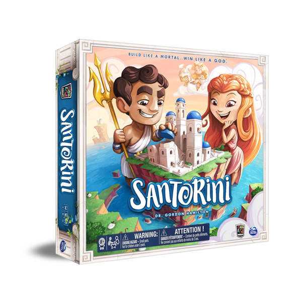

Prova Finale di Ingegneria del Software - a.a. 2019-2020
=====

Autori
-----

* Davide Volta
* Marco Riva
* Mattia Valassi

Introduzione
-----

Per l'A.A. 2019-2020 è stato richiesto lo sviluppo in linguaggio Java del gioco da tavolo Santorini di Gordon Hamilton, basandosi sulla versione offerta da Cranio Creations.
Pensato per un ambiente di gioco online da 2-3 giocatori, viene implementato tramite l'architettura progettuale Model-View-Controller combinata ad un approccio di rete basato su multithreading e socket.
L'interfaccia di gioco è stata sviluppata interamente mediante JavaFX.

Documentazione
-----
Nella documentazione richiesta sono previsti gli schemi UML iniziali e finali del progetto. Gli UML, per miglior comprensione, sono stati divisi per package più rilevanti, ma rimangono comunque presenti schemi con una visione più generale.
Sono stati anche aggiunti degli schemi ispirati ai Sequence Diagrams per meglio descrivere la gestione degli eventi e la parte di rete all'interno del progetto.
Questi file si trovano nei seguenti percorsi:

### UML
(elenco file)

### Sequence Diagrams
(elenco file)

Requisiti Coperti
-----

Il progetto copre i seguenti requisiti tra quelli specificati come richiesti (base ed aggiuntivi) all'interno delle disposizioni del corso:

### Funzionalità di Base

* Regole Semplificate: Possibile completare una partita da 2 giocatori; supportate le prime 5 divinità (Apollo, Artemis, Athena, Atlas, Demeter)
* Regole Complete: Possibile completare una partita da 2-3 giocatori; supportate tutte le divinità semplici escluso Hermes
* Il server implementa le regole del gioco e viene istanziato una singola volta per implementare una singola partita
* Client multi-istanziabile con CLI e GUI (sviluppata via JavaFX) selezionabili comodamente dal giocatore
* Completamente coperte le istruzioni per l'avvio della partita

### Funzionalità Aggiuntive

* Divinità Avanzate: sono state implementate le 5 divinità aggiuntive Hera, Hestia, Limus, Triton, Zeus

Istruzioni per il Setup
-----

### Requisiti

* JDK 14

### Utilizzo

#### Server

`java -jar santorini.jar -s`

Altre opzioni disponibili:

* `-p <porta su cui ascoltare>` 

#### Client GUI

`java -jar santorini.jar` (o doppio click sul file .jar, se la versione di Java configurata nell'ambiente é quella corretta)

#### Client CLI

`java -jar santorini.jar -c <indirizzo del server>`

Altre opzioni disponibili:

* `-p <porta a cui connettersi>`

Librerie e Plugin Utilizzati
-----

(TODO)